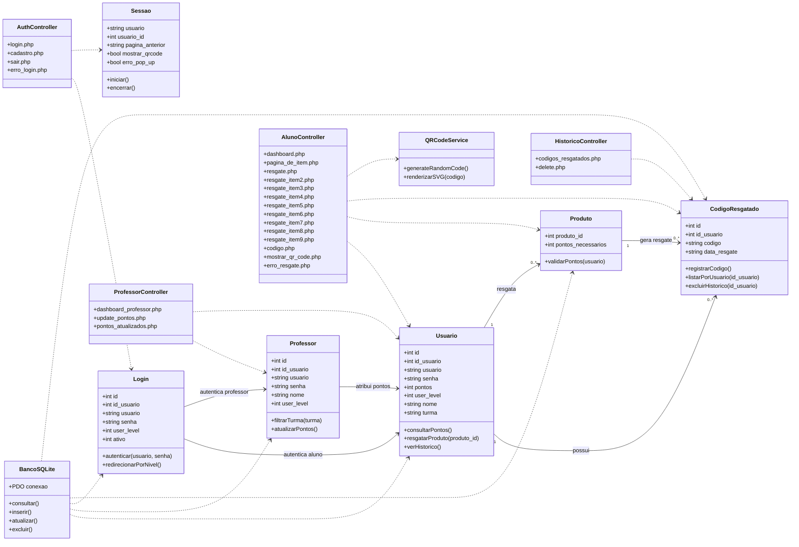
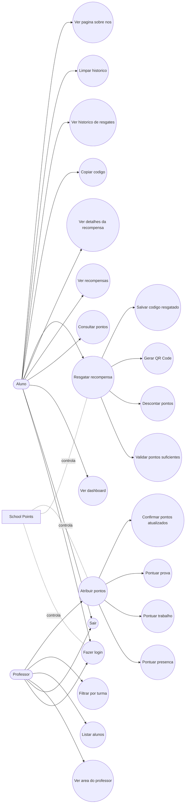

# Diagramas do Projeto Impacta

Os diagramas abaixo foram montados a partir dos arquivos PHP do projeto e do banco SQLite em `projetoimpacta/projetoimpacta/bin/Debug/net6.0-windows/banco/banco.db`.

## Diagrama de Classes

> Observacao: o projeto esta escrito de forma procedural em PHP. Por isso, este diagrama representa as entidades do dominio e os principais modulos PHP como classes conceituais.

## Diagrama de Caso de Uso

## Principais Arquivos Relacionados

- Autenticacao: `cadastro.php`, `login.php`, `sair.php`, `erro_login.php`
- Area do aluno: `dashboard.php`, `pagina_de_item.php`, `resgate.php`, `resgate_item2.php` a `resgate_item9.php`
- Resgate e QR Code: `codigo.php`, `mostrar_qr_code.php`, `gerar_qr_code.php`
- Historico: `codigos_resgatados.php`, `delete.php`
- Area do professor: `dashboard_professor.php`, `update_pontos.php`, `pontos_atualizados.php`
- Banco de dados: `usuarios`, `professores`, `logins`, `produtos`, `codigo_resgatado`, `login_direcao`
